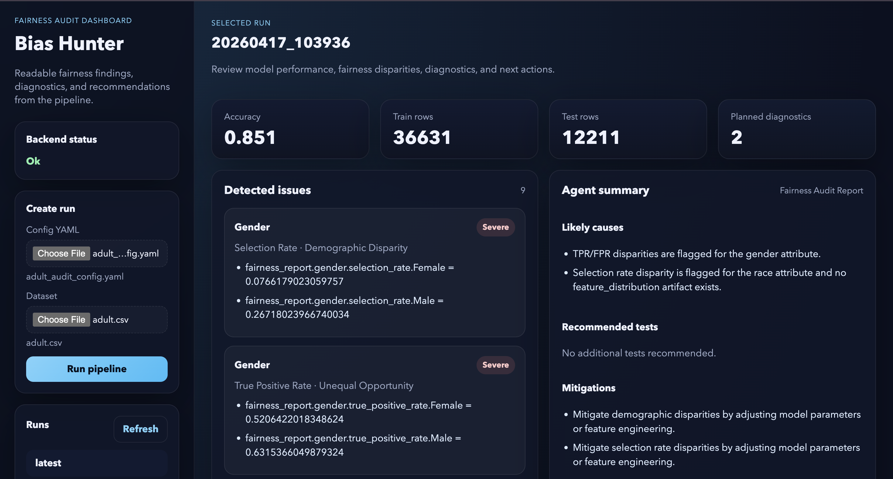

# Bias Audit Agent - Fairness Diagnosis System

## Overview
This project implements an automated fairness auditing system that detects, analyzes, and explains potential bias in machine learning decision models.

Disparity alone is not evidence of discrimination. **Unexplained disparity is.**

## Core Idea
Not every statistical difference is bias.

Bias exists when a protected attribute influences predictions in a way that cannot be explained by legitimate predictive features.

## Why This Project Is Different
Most fairness projects stop at computing metrics.

This system:

- Detects disparities
- Explains them
- Hypothesizes causes
- Recommends investigations
- Proposes mitigation strategies

That makes it a reasoning system, not just a metric calculator.

## Design Principles
- Interpretable
- Reproducible
- Evidence-based
- Modular
- Auditable
- Deterministic + Agent hybrid architecture

## What Has Been Implemented
Recent updates completed in this codebase:

- Fixed execution mode issues by standardizing module-mode commands (`python -m ...`).
- Added/validated full staged pipeline:
  1. train
  2. fairness evaluation
  3. agent plan
  4. diagnostics execution
  5. agent report
- Added deterministic post-processing in `agent_report` to avoid re-recommending diagnostics that already ran.
- Aligned `narrative_markdown` with final `recommended_tests` so report text does not contradict JSON fields.
- Removed stale narrative instruction to rerun `check_group_sample_sizes` when group sizes already exist.
- Made deterministic markdown reporting (`src/reporting.py`) dataset-agnostic across configured sensitive attributes.
- Extended report generation to include:
  - diagnostics execution summary
  - diagnostic result highlights
  - agent explanation and narrative
- Reworked Streamlit UI to reduce clutter and add:
  - tabbed layout
  - diagnostics panel with highlights
  - clearer recommendations/mitigations/limits rendering
  - dataset-column-wise sections
  - config + dataset upload flow
  - optional pipeline run from uploaded inputs

## System Pipeline
Current pipeline:

Data -> Train -> Fairness Metrics -> Agent Plan -> Diagnostics -> Agent Report -> UI/Markdown Report

Responsibility split:

- Deterministic code: metrics, diagnostics, artifacts
- LLM agent: planning and explanation from provided evidence
- UI/reporting: presentation and traceability

## Fairness Metrics
Computed via Fairlearn:

- selection_rate (demographic parity signal)
- true_positive_rate (equal opportunity signal)
- false_positive_rate (unequal harm signal)

For each sensitive attribute, the pipeline stores:

- `by_group`
- `difference`
- `ratio`
- `flags` (threshold-based)

## Diagnostics
Supported diagnostics:

- `check_group_sample_sizes`
- `run_feature_distribution_comparison`
- `run_proxy_detection`
- `run_slice_scan`
- `run_threshold_sensitivity`

Diagnostics are planned by `agent_plan`, then executed by `run_diagnostics`, with outputs saved under:

- `outputs/runs/latest/diagnostics/`
- `outputs/runs/latest/diagnostics_run_summary.json`

## Agent Layer
### `agent_plan`
Generates `requested_diagnostics` from existing evidence and avoids duplicates/already-run tests.

### `agent_report`
Generates final structured report:

- summary
- detected_issues
- likely_causes
- recommended_tests
- mitigations
- limits
- narrative_markdown

Post-processing now enforces consistency with executed diagnostics and cleans stale narrative recommendations.

## Dataset-Agnostic Status
The project is now mostly dataset-agnostic for binary tabular classification via config-driven loading and preprocessing.

Config controls:

- dataset path/format/schema
- label column and positive label
- sensitive columns
- derived columns
- fairness threshold
- minimum group size

Current constraints:

- binary classification only
- `run_proxy_detection` currently supports binary sensitive attributes

## Streamlit UI
Launch:

```bash
streamlit run ui/app.py
```

UI includes:

- Overview (artifact status + active config)
- Fairness by Column
- Diagnostics (executed tests + highlights + errors)
- Agent (issues, causes, narrative, recommendations)
- Dataset Columns (one section per column)
- Downloads

Upload mode supports:

- uploading config YAML
- uploading dataset file
- generating effective config
- running pipeline from uploaded inputs

## Installation
Create virtual environment:

```bash
python -m venv .venv
source .venv/bin/activate
```

Install dependencies:

```bash
pip install fairlearn pandas scikit-learn numpy matplotlib pyyaml streamlit
```

Install local LLM runtime (Ollama):

```bash
brew install ollama
ollama pull llama3.2
```

## Running the Pipeline (Module Mode)
Always run from project root.

1. Train
```bash
.venv/bin/python -m src.train --config config/audit_config.yaml
```

2. Fairness evaluation
```bash
.venv/bin/python -m src.evaluate_fairness_metrics --config config/audit_config.yaml
```

3. Agent plan
```bash
.venv/bin/python -m src.agent_plan
```

4. Run diagnostics
```bash
.venv/bin/python -m src.run_diagnostics
```

5. Agent report
```bash
.venv/bin/python -m src.agent_report
```

6. Deterministic markdown report
```bash
.venv/bin/python -m src.reporting --config config/audit_config.yaml
```

## Output Artifacts
Primary files in `outputs/runs/latest/`:

- `metrics.json`
- `predictions.csv`
- `fairness_report.json`
- `fairness_by_group.csv`
- `group_sizes.json`
- `agent_plan.json`
- `diagnostics_run_summary.json`
- `diagnostics/*.json`
- `agent_report.json`
- `report.md`

## Project Structure
```text
bias-hunter/
├── config/
│   ├── audit_config.yaml
│   └── schemas/
├── data/
│   └── dataset.py
├── src/
│   ├── train.py
│   ├── evaluate_fairness_metrics.py
│   ├── agent_common.py
│   ├── agent_plan.py
│   ├── run_diagnostics.py
│   ├── agent_report.py
│   └── reporting.py
├── ui/
│   └── app.py
└── outputs/
    └── runs/
```

## Notes
- `agent_plan` and `agent_report` require local Ollama access (`http://localhost:11434`).
- If sandboxed execution blocks localhost networking, run those steps with appropriate permissions.
- Use module mode (`python -m ...`) to avoid import path errors.

## One-Line Summary
An automated fairness auditor that not only measures disparities but interprets and explains them.

## Dashboard
